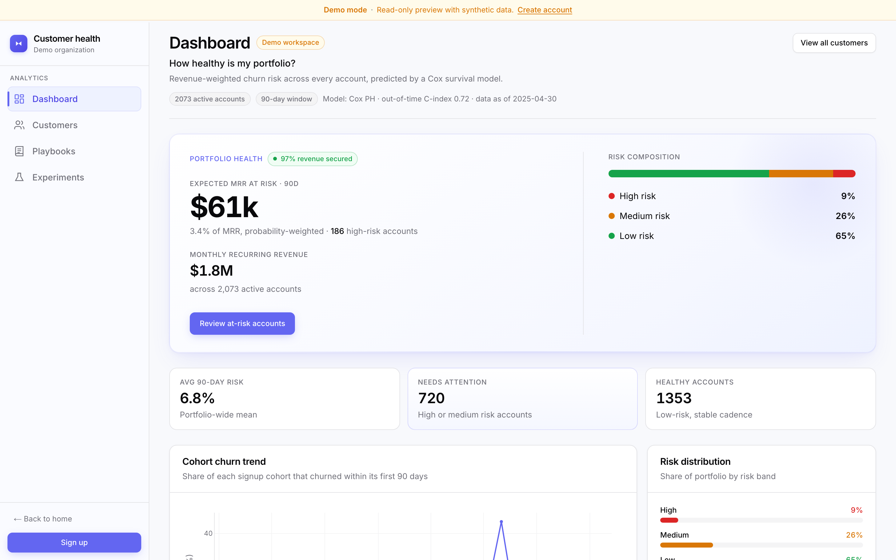
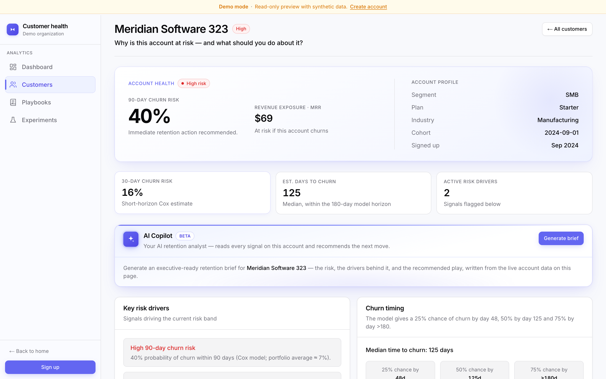
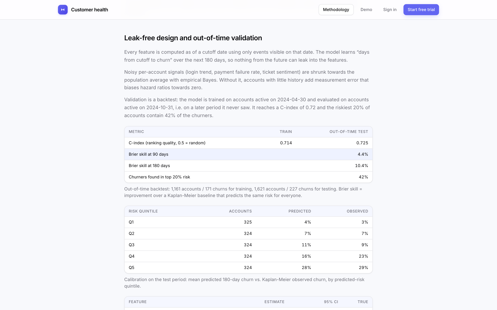

# Customer Health Intelligence

**Portfolio-grade B2B SaaS demo** — predict *when* customers will churn, explain *why* with causal playbooks, and validate interventions with A/B experiments.

Built to demonstrate product thinking, analytics depth, and clean full-stack engineering for recruiters and hiring managers.

---

## Live demo

| Link | Description |
|------|-------------|
| [**View demo (no login)**](https://customer-health-intelligence-jordi-pardo-s-projects.vercel.app/demo/dashboard) | Read-only dashboard, customers, playbooks, experiments |
| [Methodology case study](https://customer-health-intelligence-jordi-pardo-s-projects.vercel.app/methodology) | Business problem, ML approach, limitations |
| [Sign up](https://customer-health-intelligence-jordi-pardo-s-projects.vercel.app/signup) | Explore full app with demo org data |

### Screenshots

**Dashboard**: portfolio health, revenue at risk and cohort churn trend



**Customer detail**: 90/30-day churn risk, churn timing, risk drivers and AI Copilot brief



**Methodology**: out-of-time backtest, calibration and estimated vs. true coefficients



---

## What this demonstrates

- **Product sense** — CS/revenue workflow: risk scoring → drivers → playbook → experiment validation
- **ML rigor** — leak-free point-in-time features, out-of-time backtest, survival analysis (Cox), doubly robust causal estimates, all checked against a known ground truth
- **Full-stack delivery** — Next.js App Router, Supabase, Python pipelines, Vercel deploy
- **Engineering hygiene** — TypeScript, lint/typecheck CI, Playwright E2E tests, pytest leakage guards, migration scripts

---

## Stack

| Layer | Technology |
|-------|------------|
| Frontend | Next.js 16, React 19, TypeScript, Tailwind CSS v4 |
| Backend | Supabase (PostgreSQL, Auth, RLS) |
| Charts | Plotly.js |
| ML | Python — pandas, lifelines, scikit-learn |
| Deploy | Vercel + Supabase Cloud |

---

## Architecture

```
Landing / Methodology (public)
        ↓
Demo (/demo/*) — no auth, read-only
        ↓
Authenticated app — dashboard, customers, playbooks, experiments
        ↓
Supabase PostgreSQL ← Python ML pipelines (local)
```

See **[docs/ARCHITECTURE.md](docs/ARCHITECTURE.md)** for details.

---

## Project structure

```
app/
  (public)/          Landing, login, signup, methodology
  (auth)/              Authenticated app routes
  demo/                Public read-only mirror of app
components/
  views/               Page-level server components
  charts/              Plotly visualizations
  ui/                  Design system primitives
lib/
  queries/             Supabase data access
  playbook-recommendation.ts
  experiment-recommendation.ts
  customer-health.ts   Risk drivers, timeline
ml/                    Cox survival, causal ATE, feature engineering
scripts/               Data generation, seeding, pipelines
supabase/migrations/   SQL schema
tests/                 Playwright smoke tests
docs/                  Architecture, methodology, deployment
```

---

## Quick start

### 1. Environment

```bash
cp .env.example .env.local
```

Fill from Supabase → **Project Settings → API**:

- `NEXT_PUBLIC_SUPABASE_URL`
- `NEXT_PUBLIC_SUPABASE_ANON_KEY`
- `SUPABASE_SERVICE_ROLE_KEY`

### 2. Database

Run in Supabase **SQL Editor** (in order if fresh):

1. `supabase/migrations/001_initial_schema.sql`
2. `supabase/migrations/003_experiments_metadata.sql`
3. `supabase/migrations/004_playbook_touches.sql`

If a partial migration failed, use `000_reset_dev_schema.sql` first.

### 3. Install & run app

```bash
npm install
npm run dev
```

Open [http://localhost:3000](http://localhost:3000).

### 4. Python + data

```bash
python3 -m venv venv && source venv/bin/activate
pip install -r requirements.txt

python scripts/generate_synthetic_data.py
python scripts/seed_supabase.py --postgres --replace   # needs DATABASE_URL
python scripts/run_ml_pipeline.py --replace
python scripts/run_causal_pipeline.py --replace
python scripts/run_experiments_pipeline.py --replace
python -m pytest ml/tests -q                           # leakage guards
```

### 5. Quality checks

```bash
npm run lint
npm run typecheck
npm run build
npm run test:install && npm test
```

---

## ML methodology (summary)

| Stage | Method | Output |
|-------|--------|--------|
| Risk timing | Cox proportional hazards on a cutoff design, out-of-time backtest | 30d/90d churn probability, churn-timing quantiles |
| Cohort alerts | 90-day churn per cohort vs pooled baseline (binomial z-score) | Anomaly flags on dashboard |
| Playbooks | Landmark design + AIPW (doubly robust) + bootstrap CI | Segment-ranked interventions |
| Validation | Randomized A/B | Uplift, p-value, roll-out decision |
| **AI brief** | GPT-4o-mini + Langfuse tracing | CS-ready account summary on customer detail |

**Results** (synthetic data with a known ground truth, 3,000 accounts):

- **Out-of-time C-index 0.72** (train on accounts active on 2024-04-30, test on 2024-10-31); the riskiest 20% of accounts hold 42% of churners; calibrated by risk quintile
- **All 6 true hazard ratios fall inside the model's 95% CIs**
- **Playbook effects:** naive comparison off by 5.43pp on average, AIPW by 3.51pp; CIs cover the truth in 92% of cells

Full write-up: **[docs/METHODOLOGY.md](docs/METHODOLOGY.md)** · Public page: **`/methodology`**

### AI retention brief (Langfuse)

On any customer detail page, **Generate brief** calls `POST /api/ai/retention-brief` with structured account context (risk, drivers, playbooks). Responses are traced in [Langfuse](https://langfuse.com) with `customerId`, segment, and risk band metadata.

Required server env vars (local + Vercel):

```env
OPENAI_API_KEY=
LANGFUSE_PUBLIC_KEY=
LANGFUSE_SECRET_KEY=
```

---

## Database & Supabase

- **Demo org:** `Acme analytics demo` (`00000000-0000-4000-8000-000000000001`)
- New sign-ups auto-join demo org via auth trigger
- RLS enabled on all tables; app uses service role for portfolio demo reads
- 3,000 customers (2,073 active and scored), 12 causal estimates, 4 experiments

---

## Security

- Never commit `.env.local` or service role keys
- Service role key is **server-only** (Vercel env, not client)
- Use a private GitHub repo if preferred
- See [docs/DEPLOYMENT.md](docs/DEPLOYMENT.md) for production auth URLs

---

## Limitations (honest)

- Synthetic data with static customer traits — real behaviour drifts; a time-varying Cox model would be the next step
- Observational ATEs assume no unmeasured confounding; experiments are required before rollout
- A/B experiment outcomes are simulated
- Single demo tenant — not true multi-tenant isolation yet
- ML pipelines run manually (no scheduled retraining)

---

## Roadmap

**Next:** custom domain, Stripe billing (Phase 6).

See **[docs/ROADMAP.md](docs/ROADMAP.md)**.

---

## Deploy

[docs/DEPLOYMENT.md](docs/DEPLOYMENT.md) · [Post-deploy checklist](docs/POST_DEPLOY_CHECKLIST.md)

1. Import repo on Vercel
2. Set three Supabase env vars
3. Configure Supabase Auth redirect URLs
4. Smoke-test `/demo/dashboard` in incognito

---

## License

See [LICENSE](LICENSE).
